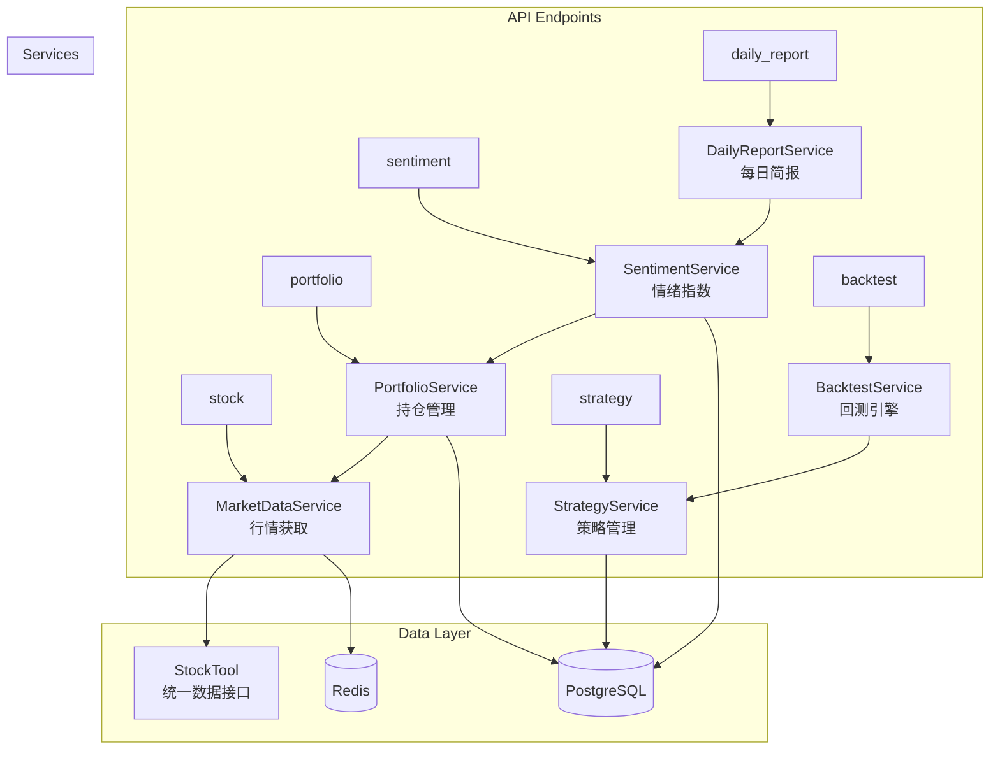

# Ruo 架构设计文档

> 更新时间：2026-03-05

## 1. 系统架构概览

Ruo 是一款 AI 智能投顾副驾系统，采用前后端分离架构：

```
┌─────────────┐      ┌──────────────┐
│   Web App   │      │  Flutter App │
│  (React)    │      │ (iOS/Android)│
└──────┬──────┘      └──────┬───────┘
       │  REST / WebSocket  │
       └──────────┬─────────┘
           ┌──────▼──────┐
           │   FastAPI   │ ← lifespan 生命周期管理
           │   Backend   │
           └──────┬──────┘
                  │
    ┌─────────────┼──────────────┐
    │             │              │
┌───▼───┐   ┌────▼────┐   ┌────▼────┐
│ PgSQL │   │  Redis  │   │ Celery  │
│ 业务DB│   │ 缓存/MQ │   │ Beat +  │
│       │   │         │   │ Worker  │
└───────┘   └─────────┘   └─────────┘
```

## 2. 后端目录结构

```
/backend
├── main.py                    # FastAPI 入口（lifespan 管理）
├── app/
│   ├── __init__.py
│   │
│   ├── core/                  # 核心基础设施（仅放全局依赖）
│   │   ├── config.py          #   Pydantic Settings 配置
│   │   ├── database.py        #   SQLAlchemy 引擎/会话/init_db
│   │   ├── llm_factory.py     #   LLM 工厂（LLMFactory 单例）
│   │   └── websocket_manager.py #  WebSocket 连接管理
│   │
│   ├── api/                   # API 路由层
│   │   ├── __init__.py        #   按业务分组注册路由
│   │   └── endpoints/         #   17 个端点模块
│   │       ├── portfolio.py   #     持仓管理
│   │       ├── stock.py       #     股票查询
│   │       ├── news.py        #     新闻情报
│   │       ├── strategy.py    #     策略管理
│   │       ├── backtest.py    #     策略回测
│   │       ├── dashboard.py   #     仪表盘
│   │       ├── concepts.py    #     概念管理
│   │       ├── concept_monitor.py # 概念异动监控
│   │       ├── short_term_radar.py # 短线雷达
│   │       ├── dragon_tiger.py#     龙虎榜分析
│   │       ├── sentiment.py   #     市场情绪指数
│   │       ├── daily_report.py#     每日简报
│   │       ├── alerts.py      #     预警管理
│   │       ├── analysis.py    #     AI 市场分析（可选）
│   │       ├── market.py      #     行情接口
│   │       └── websocket.py   #     WebSocket 端点
│   │
│   ├── services/              # 业务逻辑层（15 个服务）
│   │   ├── market_data.py     #   行情数据（实时/K线/搜索）
│   │   ├── market_price_service.py # 行情存储（日/周/月三表）
│   │   ├── portfolio.py       #   持仓管理与盈亏计算
│   │   ├── strategy.py        #   策略管理与信号生成
│   │   ├── backtest.py        #   策略回测引擎
│   │   ├── sentiment.py       #   市场情绪指数（量化）
│   │   ├── daily_report.py    #   每日开盘/收盘简报
│   │   ├── news_cleaner.py    #   新闻清洗与去重
│   │   ├── ai_analysis.py     #   AI K线/新闻分析
│   │   ├── alert.py           #   预警规则管理
│   │   ├── notification_service.py # 通知推送（飞书等）
│   │   ├── concept_monitor.py #   概念异动监控
│   │   ├── dragon_tiger.py    #   龙虎榜分析
│   │   ├── short_term_radar.py#   短线信号雷达
│   │   └── report.py          #   报告导出（PDF）
│   │
│   ├── models/                # ORM 模型层（10 个模型）
│   │   ├── user.py            #   用户
│   │   ├── portfolio.py       #   持仓（关联 strategy_id）
│   │   ├── stock.py           #   股票基本信息
│   │   ├── news.py            #   新闻
│   │   ├── strategy.py        #   交易策略
│   │   ├── alert.py           #   预警规则与日志
│   │   ├── concept.py         #   概念板块
│   │   ├── market_price.py    #   行情三表（Daily/Weekly/Monthly）
│   │   └── kline.py           #   旧版K线（仅情绪服务仍引用）
│   │
│   ├── tasks/                 # Celery 定时任务
│   │   ├── market_price_tasks.py  # 行情数据同步
│   │   ├── news_fetch_tasks.py    # 新闻定时抓取
│   │   ├── alert_tasks.py         # 预警检查
│   │   ├── price_tasks.py         # 实时价格推送
│   │   ├── stock_tasks.py         # 股票信息更新
│   │   └── websocket_tasks.py     # WebSocket 广播任务
│   │
│   ├── crawlers/              # 数据爬虫
│   │   └── xueqiu_crawler.py  #   雪球（Playwright 自动化）
│   │
│   ├── utils/                 # 工具模块
│   │   ├── stock_tool.py      #   统一外部数据接口（Tushare/AkShare）
│   │   ├── agent_browser.py   #   Playwright 浏览器封装
│   │   └── data_converter.py  #   numpy/pandas 类型转换
│   │
│   ├── llm_agent/             # LLM Agent 系统
│   │   ├── agents/            #   11 个专业分析角色
│   │   ├── graphs/            #   LangGraph 工作流编排
│   │   ├── state/             #   Agent 状态定义
│   │   └── tools/             #   Agent 工具函数
│   │
│   └── celery_config.py       # Celery 配置与 Beat 调度
│
└── tests/                     # 测试代码
```

## 3. 服务层依赖关系



## 4. 数据流

### 4.1 行情数据流

```
StockTool (Tushare → AkShare 降级) → MarketDataService (内存缓存)
                                              ↓
                                    MarketPriceService → DB (三表存储)
                                              ↓
                                    Celery Beat (每日定时同步)
```

### 4.2 新闻数据流

```
Celery Beat → news_fetch_tasks → XueqiuCrawler → NewsCleaner (去重/清洗) → DB
                                                         ↓
                                              AIAnalysisService → LLM → DB (分析结果)
```

### 4.3 WebSocket 实时推送

```
Celery Worker → price_tasks → WebSocketManager → 客户端
                                    ↓
                        按 symbol 订阅分发
```

## 5. Celery 定时任务

| 任务名 | 调度 | 说明 |
|--------|------|------|
| `sync-daily-prices` | 每日 18:30 | 同步日K数据 |
| `sync-weekly-prices` | 每周六 10:00 | 同步周K数据 |
| `sync-monthly-prices` | 每月1日 10:00 | 同步月K数据 |
| `fetch-xueqiu-hot-posts` | 每 30 分钟 | 抓取雪球热帖 |
| `batch-fetch-news-daily` | 每日 02:00 | 批量抓取历史新闻 |
| `check-alerts` | 每 5 分钟 | 检查预警触发 |
| `cleanup-old-alerts` | 每日 03:00 | 清理过期预警日志 |

## 6. LLM Agent 架构

采用 LangGraph 多智能体协作：

```
                    ┌─────────────────────┐
                    │   LangGraph 工作流   │
                    └─────────┬───────────┘
                              │
          ┌───────────────────┼───────────────────┐
          │                   │                   │
  ┌───────▼───────┐  ┌───────▼───────┐  ┌───────▼───────┐
  │ TechnicalAnlst│  │ SentimentAnlst│  │ ShortTermAnlst│
  │ 技术分析师     │  │ 情绪分析师     │  │ 短线分析师     │
  └───────┬───────┘  └───────┬───────┘  └───────┬───────┘
          │                   │                   │
          └───────────────────┼───────────────────┘
                              │
                    ┌─────────▼───────────┐
                    │ InvestDecisionMaker  │
                    │ 投资决策整合          │
                    └─────────────────────┘
```

## 7. 技术选型

| 技术 | 选择 | 理由 |
|------|------|------|
| Web 框架 | FastAPI + lifespan | 异步高性能，自动 API 文档 |
| ORM | SQLAlchemy 2.0 | 成熟稳定，declarative_base |
| 任务队列 | Celery + Redis | 分布式定时任务，消息队列 |
| LLM 框架 | LangChain + LangGraph | 多智能体编排，状态管理 |
| 数据源 | Tushare + AkShare | 互为降级备份 |
| 浏览器自动化 | Playwright | 处理动态反爬（雪球等） |
| 包管理 | uv | 快速依赖解析和虚拟环境管理 |
